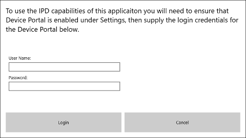
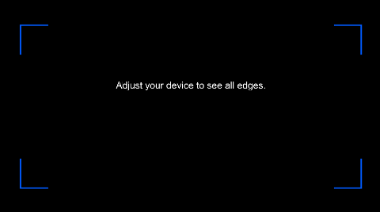

## Overview

The **FitBox and IPD** tool was developed for those who frequently give demonstrations of HoloLens at meetup groups or other events. It serves two purposes:

1. Replicates the opening screen of the Calibration app, which helps users make sure they've positioned the device correctly.
2. Allows the IPD to be set quickly using a voice command instead of needing a companion PC and the Device Portal.

The FitBox IPD tool should only be used in demonstration scenarios that require the device to be reconfigured quickly. In these scenarios, a high quality opticians pupilometer (like [this](https://amzn.com/B01BKR8B20)) should be used to measure the IPD. 

Outside of this unique scenario, users should continue to leverage the built-in Calibration app to adjust the device for their eyes.

## Installation
The **FitBox and IPD** tool must be sideloaded as a developer application. This is because network loopback is required to access the [Device Portal](https://developer.microsoft.com/en-us/windows/holographic/using_the_windows_device_portal) and update the IPD.

Be sure Device Portal is enabled on your device under **Settings -> Update & Security -> For developers** and make sure you can sign into the Device Portal via a browser before running the tool. 

A recent build of the tool can be downloaded [here](Distrib/FitBoxIPD.zip). Once downloaded, unzip the archive and use the **Apps** tab of the [Device Portal](https://developer.microsoft.com/en-us/windows/holographic/using_the_windows_device_portal) to install the package.

## Configuration
The first time you run the **FitBox and IPD** tool you will be prompted to sign in with the same credentials you use to sign into the portal. 

You will only be prompted for this information once. After a successful sign-in the credentials will be stored securely in the windows [Credential Locker](https://msdn.microsoft.com/en-us/windows/uwp/security/credential-locker) (AKA Password Vault).

If the cancel button is pressed during sign-in, or if the password for the device portal is ever changed, the application will switch to a reduced functionality mode. This mode shows only the blue borders and the "Adjust to see all edges" message.

In reduced functionality mode you can say "Sign into device portal" to begin the authentication process again.

After a successful sign-in (and on all future runs of the application) the user is presented with the screen shown at the top of the page. The screen displays the blue fit box along with the current IPD, and the user may say "Set IPD to ##" to adjust the IPD. ## can be any number between 50 and 75. 

## Removing Cached Credentials
Because credentials are stored in the Credential Locker (a system-level resource), credentials will remain in the secured store on the device even after the application is uninstalled. To manually remove these cached credentials, while the tool is running you can say "Sign out of device portal". This will sign out and remove the information from the Credential Locker. The application will then enter the limited functionality mode described above.