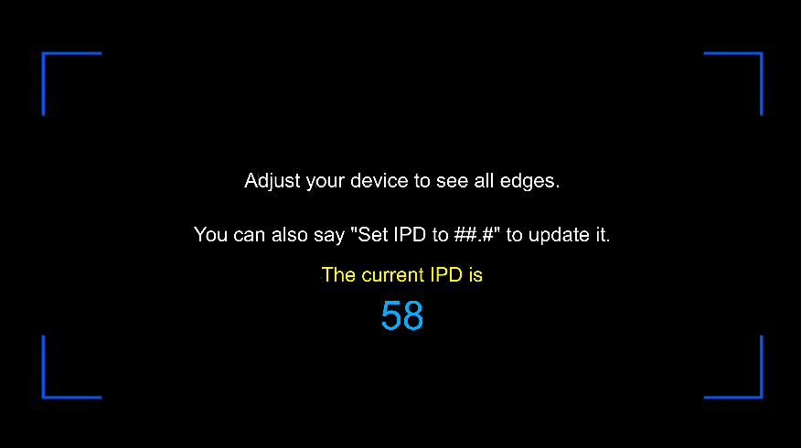

# Overview

The FitBox and IPD tool was developed for those who frequently give demonstrations of HoloLens at meetup groups or other events. It serves two purposes:

1. Replicates the opening screen of the Calibration app, which helps users make sure they've positioned the device correctly.
2. Allows the IPD to be set quickly using a voice command instead of needing a companion PC and the Device Portal.

The FitBox IPD tool should only be used in demonstration scenarios that require the device to be reconfigured quickly. In these scenarios, a high quality opticians pupilometer (like [this](https://amzn.com/B01BKR8B20)) should be used to measure the IPD. 

Outside of this unique scenario, users should continue to leverage the built-in Calibration app to adjust the device for their eyes. 